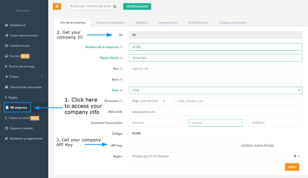

This is the **stage** API environment of Enviame, this site is intended to be a starting point for begin to consume our delivery logistic technology.

# Introduction

This API definition will allow you to create a complete integration of your delivery operations with the technology of Enviame in a safe and stable **stage** environment, so all the delivery orders you dispatch through the following paths will be avalivable in [Our Stage Platform](http://sandbox.easypoint.co/).

It also demonstrates all features of the
[Production Platform](https://platform.enviame.io/).

# What Enviame Stage Enviroment is capable?

In this documentation you will find all the available **endpoints** of our API.
To use any of the following endpoints, a company id is needed, as well as your company API Key.

You can find that information in your [company profile](http://sandbox.easypoint.co/).

/*
Insert something more here...
*/